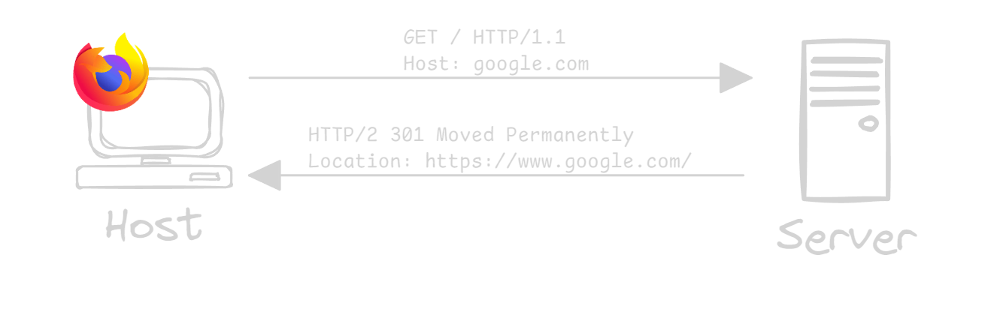
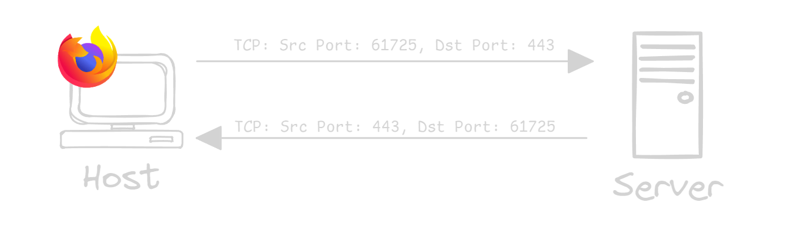
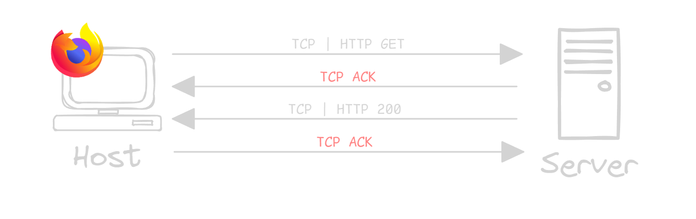
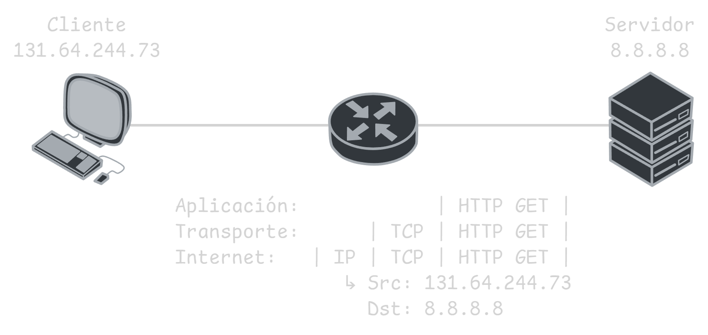
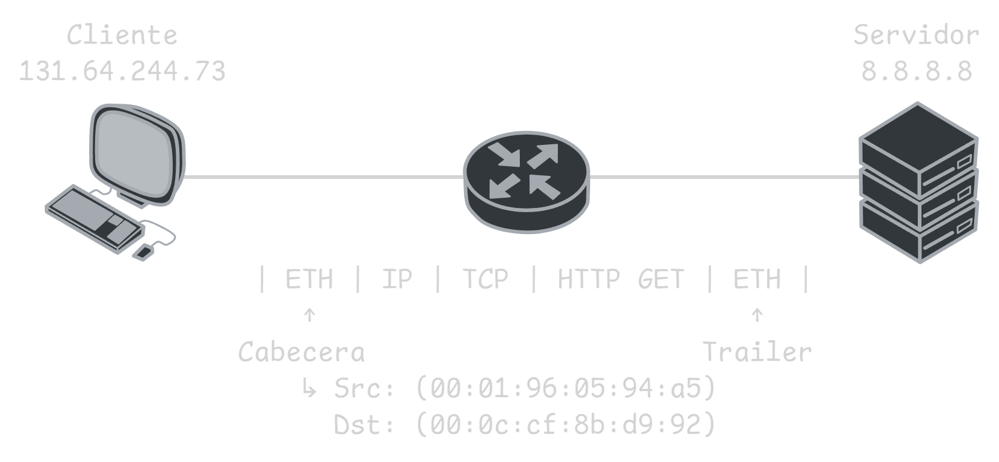

# 1.2 Estándares de Comunicación: TCP/IP y OSI

Las **redes informáticas** tienen como finalidad compartir recursos. Para que cualquier dispositivo pueda emitir y recibir información, independientemente de la marca, se establecieron estándares de comunicación, como los modelos **TCP/IP** y **OSI**, que definen cómo deben estructurarse y transmitirse los datos para garantizar la interoperabilidad entre sistemas.

> EL modelo OSI fue creado por la agencia ISO (International Organization for Standardization) mientras que TCP/IP por voluntarios de distintas universidades y ambos son modelos abiertos.

## Modelo TCP/IP

Tiene un modo de operar por capas, cada uno con funciones específicas e protocolos específicos.

| Capas                       | Protocolos                         |
| --------------------------- | ---------------------------------- |
| Application / Aplicación    | HTTP, POP3, SMTP, IMAP ...         |
| Transport / Transporte      | TCP, UDP ...                       |
| Internet                    | IP, IPsec, ICMP...                 |
| Network link / Acceso a red | Ethernet, MAC/LLC, Frame Relay ... |

### Capa de Aplicación

**Capa encargada de brindar los protocolos a los servicios o aplicaciones** para que estos puedan iniciar el proceso de comunicación en red.

Por ejemplo el protocolo HTTP, el cual es usado por los navegadores. En el siguiente ejemplo se ve parte inicial de una Request HTTP y una Response HTTP, en este caso en particular da el estatus 301 con la descripción de Moved Permanently. 


En HTTP, el cliente incluye más información de la capa en la cabecera, como podría ser el navegador que está utilizando, el sistema operativo, cookies, etc. El siguiente muestra la cabecera HTTP un poco más extendida.

``` HTTP
GET / HTTP/1.1
Host: google.com
Cookie: AEC=<AEC Cookie>; NID=<NID Cookie>
Sec-Ch-Ua-Platform: "Windows"
Accept-Language: es-419,es;q=0.9
Upgrade-Insecure-Requests: 1
User-Agent: Mozilla/5.0
Accept: text/html,application/xhtml+xml,image/avif,image/webp
Accept-Encoding: gzip, deflate, br
Priority: u=0, i
Connection: keep-alive
```

### Capa de Transporte

**Capa encargada de identificar a qué aplicación va dirigida la comunicación** y lo logra . Se utiliza principalmente dos protocolos, TCP (Transmission Control Protocol) y UDP (User Datagram Protocol) y se logra identificar a la aplicación o servicio mediante los **puertos**.



Cada protocolo es usado con una distinta funcionalidad, TCP provee recuperación ante error por los paquetes ACK (acknowledgments)., en caso el cliente o servidor no reciban estos paquetes, el protocolo TCP reenviaría los datos.



El protocol UDP envía los datos son confirmación, lo cuál le da mayor velocidad en la transmisión a diferencia que TCP.

### Capa de Internet

**Capa encargada de identificar el host o servidor al que va dirigida la comunicación**. Se basa mayormente en el protocolo IP y logra identificar a un host mediante su **dirección IP**.



El labor que cumple el router es el proceso de enrutamiento, el cual es enviar el paquete por la ruta más adecuada.

### Capa de Accesos a la Red

**Última caba encargada de definir el procedimiento y hardware necesario para que la entrega de datos puede llevarse acabo mediante el medio físico correspondiente**. El protocolo depende del medio físico, por ejemplo en **LAN es común Ethernet**, y en **WAN es común PPP o HDCL**., y para identificar el host al cual enviar la información se identifica con la **MAC address**.



### Procedo de Encapsulación y Envío de Datos

En cada capa, se agrega una cabecera con la información necesaria, este proceso es llamado encapsulación y la información en cada capa tienen cierto nombre.

| Capa         | Protocol Data Unit   |
| ------------ | -------------------- |
| Aplicación   | Datos / Data         |
| Transporte   | Segmentos / Segments |
| Internet     | Paquetes / Packets   |
| Acceso a Red | Trama / Frames       |

## Modelo OSI

El modelo Open System Interconnection fue creado por ISO (International Organization for Standardization) en 1984 y está conformado por 7 capas, cada una con un propio PDU, las cuales son las siguientes. 

| Capa            | Protocol Data Unit   | Tipo |
| --------------- | -------------------- | ---- |
| Aplicación      | Datos / Data         | Host |
| Presentación    | Datos / Data         | Host |
| Sesión          | Datos / Data         | Host |
| Transporte      | Segmentos / Segments | Red  |
| Red             | Paquetes / Packets   | Red  |
| Enlace de datos | Trama / Frame        | Red  |
| Física          | Bits                 | Red  |

### 7 - Capa de Aplicación

**Capa encargada de proporcionar la interactividad de las aplicaciones con la red**, por ejemplo los navegadores web o un cliente de correos. Los protocolos más comunes en esta capa son:

| Protocolo                                  | Función                                                                          |
| ------------------------------------------ | -------------------------------------------------------------------------------- |
| HTTP (Hypertext Transfer Protocol)         | Permite la transferencia de páginas web y contenido en la red.                   |
| HTTPS (Hypertext Transfer Protocol Secure) | Proporciona transferencia de datos web segura mediante encriptación.             |
| TELNET                                     | Permite acceso remoto a dispositivos y servidores en texto plano (sin cifrado).  |
| SSH (Secure Shell)                         | Proporciona acceso remoto seguro a dispositivos mediante encriptación.           |
| FTP (File Transfer Protocol)               | Facilita la transferencia de archivos entre dispositivos en una red.             |
| SFTP (Secure File Transfer Protocol)       | Transfiere archivos de forma segura utilizando SSH para la encriptación.         |
| DNS (Domain Name System)                   | Traduce nombres de dominio en direcciones IP para localizar recursos en la red.  |
| SMTP (Simple Mail Transfer Protocol)       | Envía correos electrónicos entre servidores de correo.                           |
| POP3 (Post Office Protocol v3)             | Descarga correos electrónicos del servidor al cliente y los almacena localmente. |
| DHCP (Dynamic Host Configuration Protocol) | Asigna automáticamente direcciones IP y configuración de red a dispositivos.     |

### 6 - Capa de Presentación

**Capa encarga de preparar los datos para que puedan ser utilizados por la capa de aplicación, asegurando que sean legibles y procesables**. Sus funciones principales incluyen la **traducción de datos** entre diferentes métodos de codificación (como UTF-8 a ASCII), la **encriptación y desencriptación** de datos en conexiones seguras (usualmente con SSL/TLS) y la **compresión de datos** para optimizar la velocidad y eficiencia en la comunicación.

> La compresión puede ser con pérdida (sin garantizar la integridad) o sin pérdida (manteniendo la integridad).

### 5 - Capa de Sesión

**Capa encargada de gestionar la apertura, duración y cierre de sesiones entre dispositivos, asegurando el uso eficiente de recursos**. También sincroniza la transferencia de datos mediante puntos de control para reanudar las transmisiones desde el último progreso en caso de fallos. Sus tareas incluyen autenticación, autorización y manejo de datos en forma de paquetes.

### 4 - Capa de Transporte

**Capa encargada de gestionar la comunicación de extremo a extremo**, dividiendo datos en segmentos (TCP) o datagramas (UDP) para su transmisión y reensamblándolos al recibirlos. TCP es más confiable pero lento, mientras que UDP es rápido pero menos seguro. Esta capa también regula la **velocidad de transmisión** (control de flujo) y asegura la **integridad de los datos** (control de errores).

Esta capa también es encargada de identificar a la aplicación por el uso de los puertos, dichos servicios y/o aplicaciones usan puestos por defecto como los siguientes:

| Protocolo | Puerto                                   |
| --------- | ---------------------------------------- |
| HTTP      | 80 (TCP)                                 |
| HTTPS     | 443 (TCP)                                |
| TELNET    | 23 (TCP)                                 |
| SSH       | 22 (TCP)                                 |
| FTP       | 21 (TCP)                                 |
| SFTP      | 22 (TCP)                                 |
| DNS       | 53 (TCP/UDP)                             |
| SMTP      | 25 (TCP), 587 - encrypted (TCP)          |
| POP3      | 110 (TCP), 995 - encrypted (TCP)         |
| DHCP      | 67 - servidor (UDP), 68 -  cliente (UDP) |

### 3 - Capa de Red

**Capa que permite la transferencia de datos entre redes diferentes**, dividiendo los segmentos en paquetes y asegurando su reensamblaje en el destino. También gestiona el enrutamiento y la selección de rutas óptimas mediante protocolos como OSPF y BGP, y realiza el direccionamiento lógico utilizando IPv4 o IPv6.

### 2 - Capa de Enlace de Datos

**Capa que asegura la transferencia de datos entre dispositivos dentro de la misma red**. Convierte paquetes en tramas, gestiona el control de flujo y errores, utiliza direcciones MAC para el direccionamiento físico y controla el acceso al medio para transmitir y recibir datos.

Divide su modo de operar en dos subcapas, LLC y MAC.

- Logical Link Control: Identifica el protocolo de la capa de red y convierte el paquete en trama.
- Media Access Control: Agrega las direcciones MAC, controla el acceso a medios mediante CSMA/CD o CSMA/CA, realiza el control de flujo y detección de errores.

Los protocolos más comunes para los distintos medios son:

- IEEE 802.3    (Ethernet)
- IEEE 802.5    (Token Ring)
- IEEE 802.11  (Wireless)
- ITU Q.922    (Frame Relay)
- ITU Q.921    (ISDN)
- ITU HDCL    (Control de enlace de datos de alto nivel)

> Cada protocolo tienen un MTU (Maximum Transmission Unit) que en el caso del Ethernet es 1500 bytes.

### 1 - Capa Física

**Capa encargada de gestionar los componentes físicos de la transferencia de datos**, como cables y switches, y convierte los datos en un flujo de bits. Además, establece una convención de señal compartida entre los dispositivos para diferenciar correctamente entre 1s y 0s.

En esta capa hay 2 procesos claves:

- Codificación: Transformar los datos a bits.
- Señalización: Representar los bits en el medio físico.

## Comparación entre modelo OSI y TCP/IP

| Capa OSI | OSI          | Capa TCP/IP | TCP/IP         | Protocol Data Unit    |
| -------- | ------------ | ----------- | -------------- | --------------------- |
| 7        | Application  | 4           | Application    | Data                  |
| 6        | Presentation | 4           | Application    | Data                  |
| 5        | Session      | 4           | Application    | Data                  |
| 4        | Transport    | 3           | Transport      | Segments \| Datagrams |
| 3        | Network      | 2           | Internet       | Packets               |
| 2        | Data Link    | 1           | Network Access | Frames                |
| 1        | Physical     | 1           | Network Access | Bits                  |
